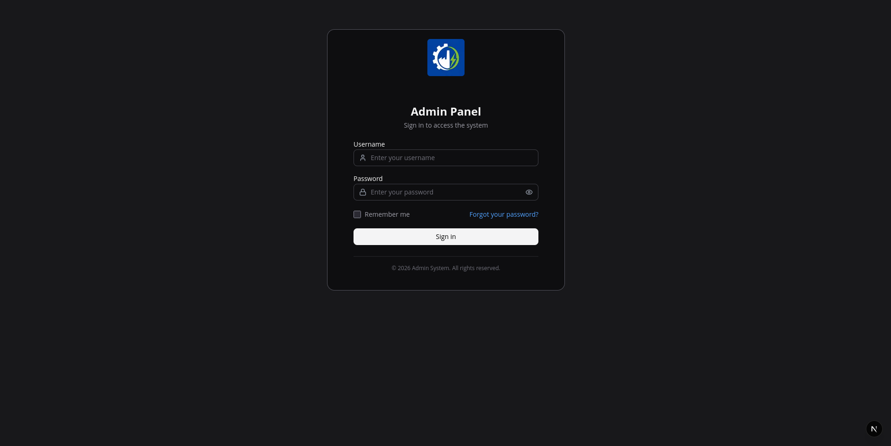
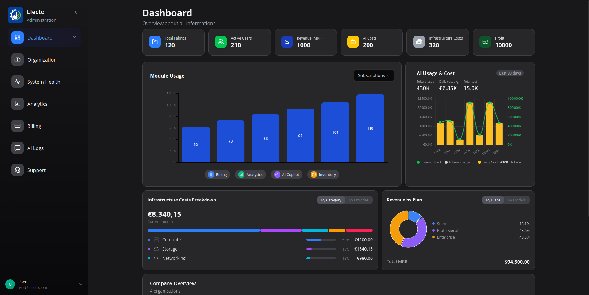
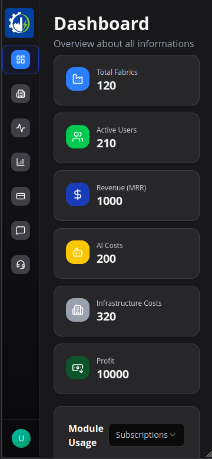
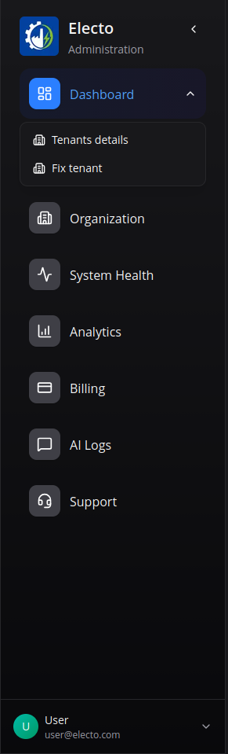
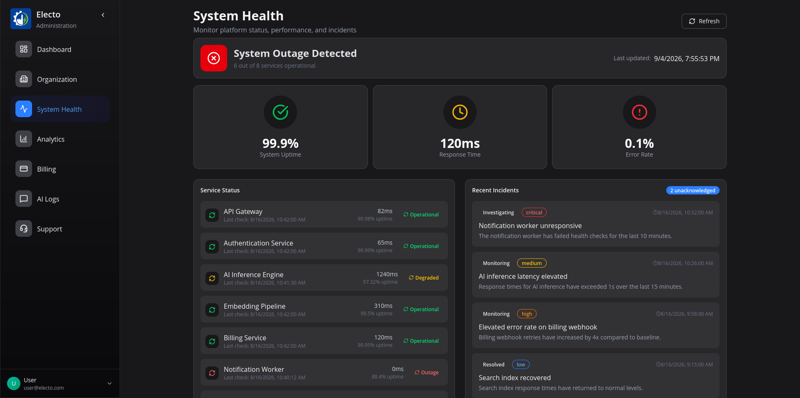

# AI Platform Admin — Frontend

A responsive admin dashboard for managing a multi-tenant AI platform — tenants, billing, analytics, AI usage, system health and support tickets — built as a fully functional front-end demo powered by mock data.

> **Note:** this is a UI-focused project. All data comes from local mocks, so it runs out of the box with **no backend and no environment variables**.

This repository intentionally focuses on the admin experience: responsive workflows,
typed mock data, reusable UI primitives and realistic client-side state. A future
project can replace the mock layer with a backend without changing the page structure.

[Vercel preview](https://ai-platform-admin-frontend.vercel.app/)

## ✨ Features

- **Dashboard** — revenue, MRR, profit margin, online users and infrastructure KPIs with interactive charts
- **Organization** — filterable/searchable tenant list with status & health indicators, plus detailed tenant view (overview, billing, users, modules, connectors, activity)
- **Tenant creation wizard** — multi-step flow (company → plan → modules & add-ons → payment → confirmation) with Zod-validated forms
- **Billing** — subscriptions, recent invoices, alerts and revenue-by-plan breakdown
- **Analytics** — usage overview with rankings by user, project and conversation, token consumption and daily charts
- **AI Logs** — query logs with status, top agents and response-time metrics
- **System Health** — service status, incidents and alerts
- **Support** — ticket list with priorities, statuses and stats
- **Theme** — full light/dark mode across the entire app

## 🛠 Tech stack

- [Next.js 16](https://nextjs.org) (App Router) + [React 19](https://react.dev)
- TypeScript (strict mode)
- [Tailwind CSS 4](https://tailwindcss.com) + shadcn/ui-style component system (Radix primitives)
- Data visualization: [Recharts](https://recharts.org), [Chart.js](https://www.chartjs.org) and [MUI X Charts](https://mui.com/x/)
- [Zustand](https://zustand.docs.pmnd.rs) for state management
- [Zod](https://zod.dev) + React Hook Form for form validation

## 🚀 Getting started

Requires **Node.js 18+** and **pnpm**.

```bash
# install dependencies
pnpm install

# start the dev server
pnpm dev
```

Open [http://localhost:3000](http://localhost:3000) — no extra setup needed.

### Available scripts

| Script           | Description                          |
| ---------------- | ------------------------------------ |
| `pnpm dev`       | Start the development server         |
| `pnpm build`     | Create an optimized production build |
| `pnpm start`     | Serve the production build           |
| `pnpm lint`      | Run ESLint                           |
| `pnpm format`    | Run Prettier                         |
| `pnpm typecheck` | TypeScript check (`tsc --noEmit`)    |

## 📁 Project structure

```
src/
├── app/                  # App Router pages (dashboard routes)
├── components/
│   ├── atoms/            # Basic UI building blocks (button, card, dialog, input...)
│   ├── molecules/        # Combinations of atoms (toolbars, cards, tab bars, sidebars)
│   ├── organisms/        # Complex sections (lists, charts, modals, wizards)
│   └── templates/        # Full page layouts
├── lib/
│   ├── types/            # Centralized domain type definitions
│   ├── storage.ts        # SSR-safe browser storage helpers
│   ├── schemas/          # Zod validation schemas
│   ├── utils/            # Domain helpers
│   └── store/            # Client state (Zustand)
├── mocks/                # Mock data powering the demo
└── hooks/                # Reusable React hooks
```

## Engineering notes

- **Offline by design:** pages consume the typed modules in `src/mocks/`; there is no API client in this repository.
- **Validation:** run `pnpm typecheck`, `pnpm lint -- --max-warnings 0` and `pnpm build` before opening a pull request.
- **State:** transient UI state stays in components or Zustand, while browser persistence goes through `src/lib/storage.ts`.
- **Accessibility:** interactive controls use semantic buttons, visible focus styles and ARIA metadata where the UI needs additional context.
- **Architecture:** reusable props live in `src/lib/types/components/`, while feature payloads stay in domain-specific type files.

## Portfolio walkthrough

The recommended demo path is:

1. Open the dashboard and switch between light and dark themes.
2. Search and filter tenants in Organization, then open a tenant detail view.
3. Run through the tenant creation wizard and inspect its validation states.
4. Compare Billing and Analytics views, including responsive layouts.
5. Open Health and Support to see operational states, incidents and tickets.

The screenshots in `public/screenshots/` document the main responsive surfaces.

## 📸 Screenshots

### Login page



### Dashboard



### Dashboard responsive



### Sidebar subitems



### System Health


